# SmartBudget - Personal Finance Management Made Simple

## 📱 Overview

**SmartBudget** is a user-friendly, privacy-first mobile budget management application designed for Android. Unlike traditional financial apps, SmartBudget eliminates the need for bank account linking, complex setup processes, and intrusive data collection. Instead, it focuses on what truly matters: **helping you track your spending and motivate you to save through meaningful goals**.

---

## 💡 The Idea: Why SmartBudget?

What started as an academic mini-project for my Mobile Development module quickly evolved into a personal mission. After exploring numerous budget management apps available in app stores, I discovered a common frustration: **most apps either require bank account linking, overwhelming complexity, or prioritize data collection over user privacy**. 

The core realization? Users don't need fancy financial integrations—they need **simplicity, control, and motivation**. I decided to transcend the basic academic requirements and engineer a truly production-ready application that could be used on a daily basis as a personal utility tool.

SmartBudget was born from this insight:
- ✅ **No bank linking required** — manually log your expenses in seconds
- ✅ **Privacy-first approach** — all data stays on your device
- ✅ **Motivation-driven** — focus on savings goals that give real reasons to save money
- ✅ **Intuitive interface** — easy enough for anyone, powerful enough for serious budgeters

The key differentiator is **shifting focus from constraint-based budgeting to goal-based saving**. Instead of just limiting spending, SmartBudget helps you visualize and work towards meaningful financial goals—whether it's a vacation, emergency fund, or investment. This psychological shift transforms budgeting from a chore into a motivating journey.

---

## 🎯 Core Features

### 1. **Dashboard & Home Screen**
- Quick overview of monthly spending with personalized greeting
- Visual breakdown of top spending categories
- Real-time budget status and remaining balance
- Snapshot of active savings goals (top 3)
- Recent expense history for quick reference

### 2. **Expense Tracking**
- Fast, intuitive expense logging with:
  - Amount, currency, and category selection
  - Optional notes and payment method tracking
  - **Necessity Rating (1-5 scale)**: Encourages mindful spending by explicitly identifying non-essential purchases before finalizing the transaction.
  - Automatic date assignment (customizable)
- Organized by date and category for easy searching
- Support for manual entry—no account linking required

### 3. **Smart Budget Management**
- **Monthly budgets**: Set overall spending limits for each month
- **Category-based budgets**: Control spending limits per category (Food, Transport, Entertainment, etc.)
- Real-time tracking against budget limits
- Visual warnings when approaching or exceeding budget limits
- Track remaining balance at a glance

### 4. **Savings Goals** ⭐ *The Core Motivation*
- Create meaningful financial goals with:
  - Target amount and optional target date
  - Progress visualization (current vs. target amount)
  - Completion tracking
- Add contributions to goals from saved money
- Track multiple goals simultaneously
- Goal completion notifications for psychological rewards
- Edit or delete goals as life circumstances change

### 5. **Recurring Expenses**
- Automate tracking of regular expenses (rent, subscriptions, etc.)
- Set frequency (daily, weekly, monthly, etc.)
- Material 3 modals providing robust start and end native date pickers
- Automatic generation of recurring expense instances
- Optional end dates for temporary recurring expenses
- Easy management of active recurring rules

### 6. **Categories & Customization**
- Pre-defined default categories (Food, Transport, Entertainment, Utilities, Shopping, Healthcare, Other)
- Custom category creation with personalized colors and icons
- Organize expenses logically
- Active category management (create, rename, archive, delete)

### 7. **User Profile & Settings**
- Personalized user information (name, currency preference)
- Multi-currency support (set your preferred currency)
- Data portability: Export and Import your data securely via CSV
- Onboarding flow for first-time users
- Settings screen for easy preference management

### 8. **Analytics & Insights**
- Category-wise spending breakdown
- Monthly expense trends
- Budget vs. actual spending comparison
- Goal progress visualization

---

## 🏗️ Architecture

SmartBudget follows **clean architecture principles** with a clear separation of concerns:

### **Data Layer**
- **Room Database**: Local SQLite database for reliable, offline-first data storage
- **Entities**: 
  - `ExpenseEntity` — Individual expense records
  - `CategoryEntity` — Expense categories
  - `MonthlyBudgetEntity` — Monthly budget limits
  - `CategoryMonthlyBudgetEntity` — Per-category monthly limits
  - `SavingsGoalEntity` — Financial goals and targets
  - `SavingsContributionEntity` — Contributions towards goals
  - `RecurringRuleEntity` — Recurring expense rules
- **DAOs**: Type-safe database access with reactive flows
- **Repositories**: Abstract business logic from data sources

### **Presentation Layer**
- **Jetpack Compose UI**: Modern, declarative UI framework
- **MVVM Architecture**: ViewModels manage UI state independently
- **StateFlow**: Reactive, observable state management
- **Bottom Tab Navigation**: Easy access to Home, Budgets, Quick Add, Goals, and Settings
- **Contextual Actions**: Access features like Recurring Expenses and complete Expense Lists intuitively from the Home dashboard

### **Key Components**
- `AppContainer` — Dependency injection container
- `SmartBudgetDatabase` — Room database configuration
- `ViewModels` — Business logic and state management per feature
- `Repositories` — Data layer abstraction (Budget, Expense, Category, Savings, Recurring)

---

## 📊 Data Model Overview

```
Expenses (many)
  ├── Amount (in minor currency units for precision)
  ├── Category (foreign key to CategoryEntity)
  ├── Date
  ├── Note (optional)
  ├── Payment Method (optional)
  └── Necessity Rating (1-5 scale, optional)

Categories (default + custom)
  ├── Name
  ├── Icon
  └── Active Status

Budgets
  ├── Monthly Budget (overall limit per month)
  └── Category Monthly Budgets (per-category limits)

Savings Goals
  ├── Name
  ├── Target Amount
  ├── Current Amount
  ├── Target Date (optional)
  └── Completion Status

Recurring Rules
  ├── Name
  ├── Amount
  ├── Frequency
  ├── Category
  └── Active/Inactive Status
```

---

## 🛠️ Technology Stack

| Component | Technology |
|-----------|-----------|
| **Language** | Kotlin |
| **UI Framework** | Jetpack Compose |
| **Architecture** | MVVM + Clean Architecture |
| **Database** | Room (SQLite) |
| **State Management** | StateFlow, Flow, Coroutines |
| **Build System** | Gradle |
| **Minimum SDK** | Android 5.0+ (API 21+) |
| **Target SDK** | Latest Android |
| **Icons** | Lucide Icons |
| **Theme** | Material Design 3 |

---

## 🚀 Getting Started

### Prerequisites
- Android Studio (latest)
- JDK 11+
- Android SDK 21+

### Installation & Build
1. Clone the repository
2. Open in Android Studio
3. Sync Gradle files
4. Build: `./gradlew build`
5. Run on emulator or device

### Project Structure
```
SmartBudget/
├── app/
│   ├── src/main/java/com/omargannoune/smartbudget/
│   │   ├── MainActivity.kt                    # Entry point
│   │   ├── SmartBudgetApp.kt                 # Application class
│   │   ├── data/                              # Data layer
│   │   │   ├── local/                        # Room database & entities
│   │   │   ├── preferences/                  # User preferences
│   │   │   ├── repository/                   # Repository interfaces & implementations
│   │   │   └── util/                         # Data utilities (TimeProvider, etc.)
│   │   └── ui/                                # Presentation layer
│   │       ├── home/                         # Dashboard screen
│   │       ├── expenses/                     # Expense tracking
│   │       ├── budgets/                      # Budget management
│   │       ├── goals/                        # Savings goals
│   │       ├── recurring/                    # Recurring expenses
│   │       ├── settings/                     # Settings & preferences
│   │       ├── navigation/                   # App navigation
│   │       ├── theme/                        # Material Design 3 theming
│   │       └── components/                   # Reusable UI components
│   ├── build.gradle.kts                      # App-level build config
│   └── schemas/                              # Room database schemas
├── build.gradle.kts                          # Project-level build config
├── settings.gradle.kts                       # Gradle settings
└── gradle/libs.versions.toml                 # Dependency versions
```

---

## 💾 Data Privacy & Storage

- **100% Local Storage**: All data is stored locally on your device using Room database
- **No Cloud Sync**: Your financial data never leaves your device
- **No Tracking**: No analytics, no ads, no data collection
- **No Permissions**: Minimal Android permissions required
- **SQLite Encryption Ready**: Database can be encrypted for additional security (future enhancement)

---

## 🎨 User Interface

SmartBudget features a modern, clean interface built with Material Design 3:

### Screens
1. **Home Dashboard**: Overview of spending and goals
2. **Expenses Screen**: Log and view all expenses
3. **Budgets Screen**: Set and monitor monthly budgets
4. **Goals Screen**: Create and track savings goals
5. **Recurring Screen**: Manage recurring expenses
6. **Settings Screen**: Customize app preferences
7. **Onboarding**: First-time user setup flow

All screens use:
- Smooth animations and transitions
- Responsive layouts for various screen sizes
- Intuitive bottom navigation for easy access
- Real-time data updates with reactive flows

---

## � Screenshots

### Onboarding Flow

**Welcome Screen**
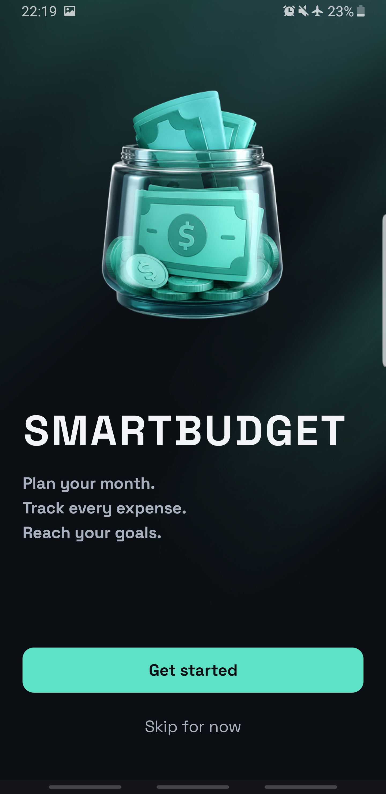

**Profile Setup**
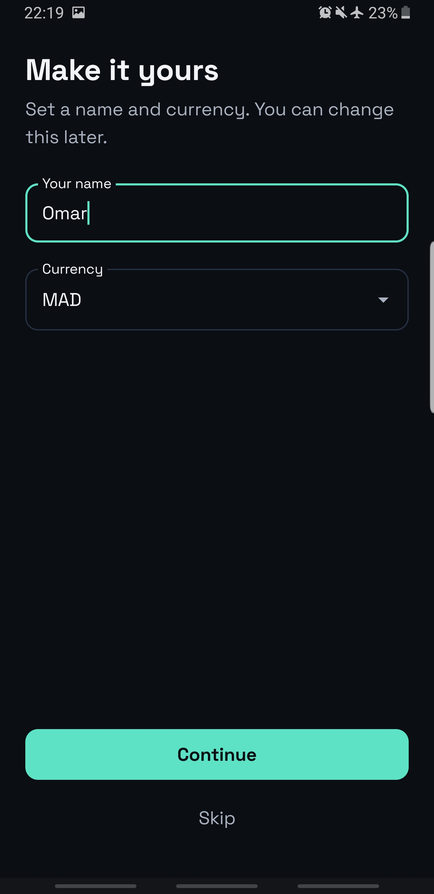

**Savings Goals Creation**
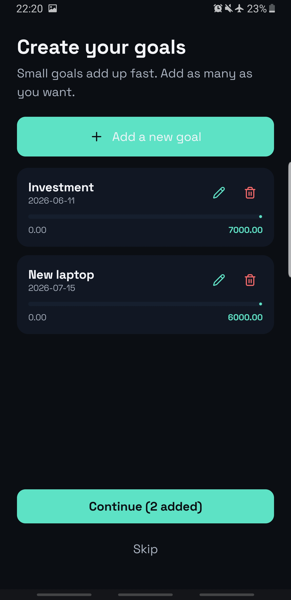

**Category Selection**
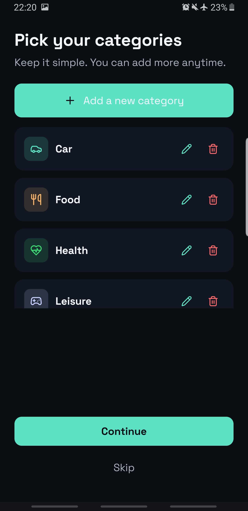

**Add Custom Category**
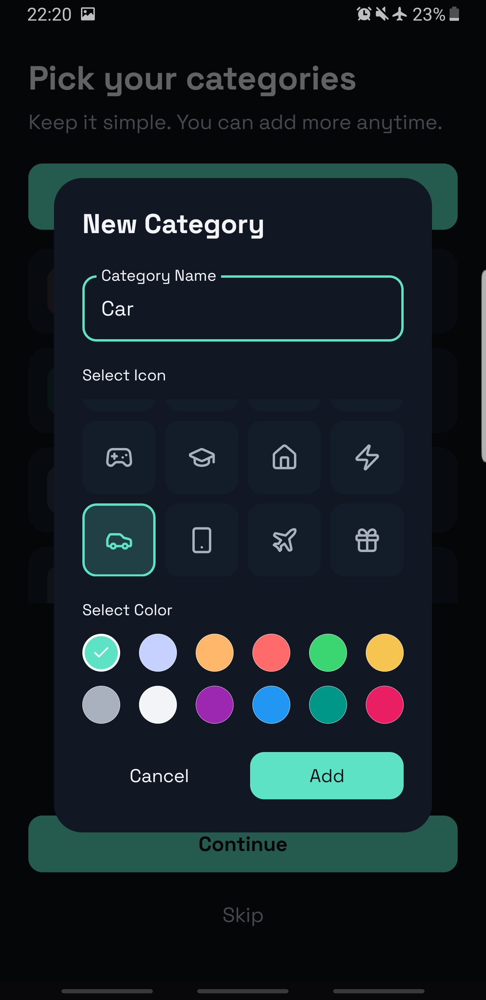

**Monthly Budget Configuration**
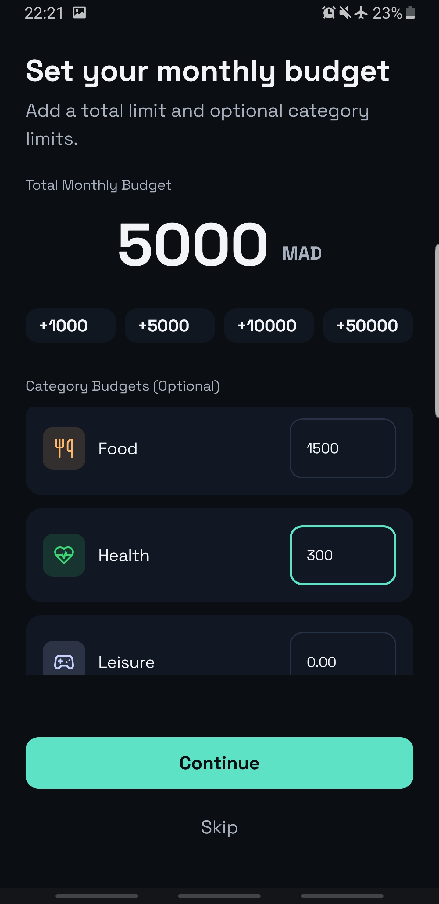

**Onboarding Complete**
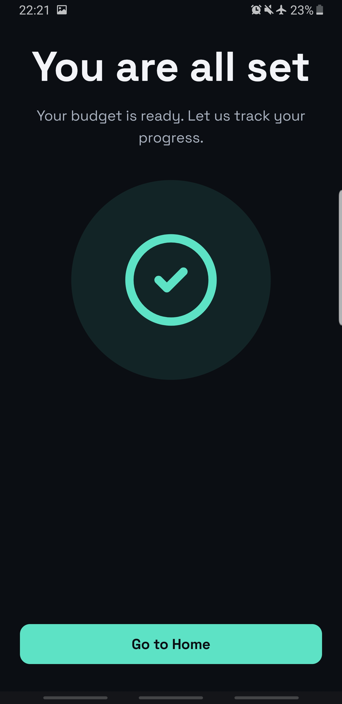

### App Screens

**Home — Empty State**
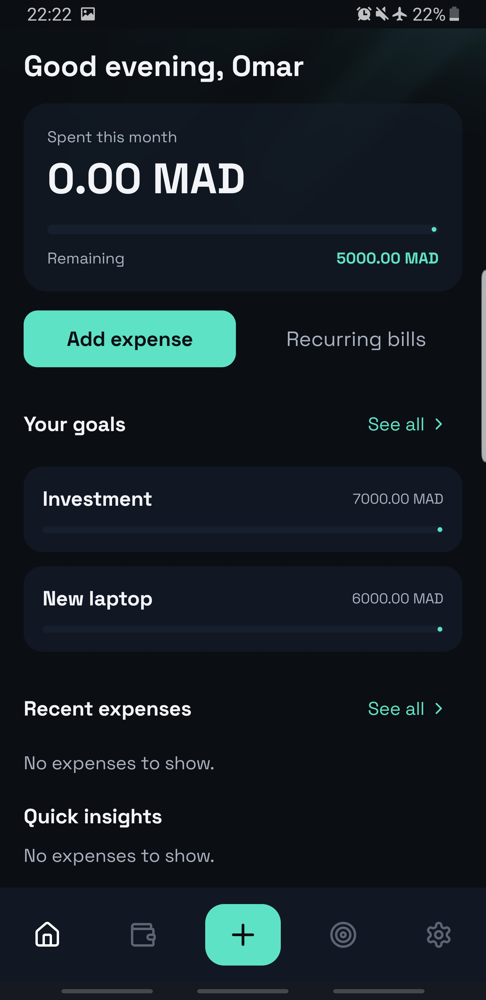

**Expenses — Empty History**
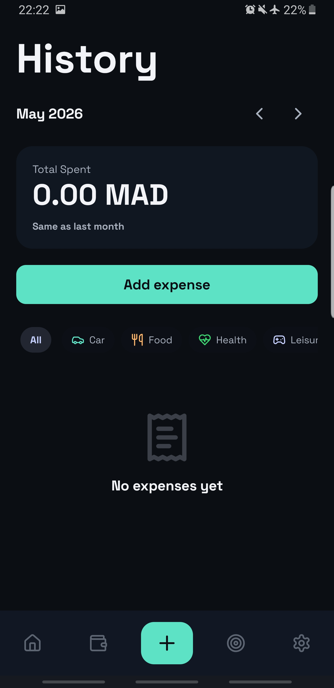

**Home Dashboard (Part 1)**
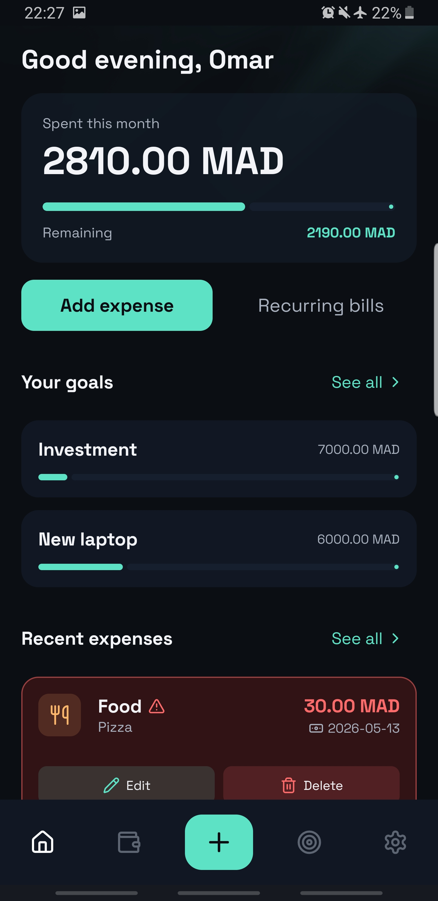

**Home Dashboard (Part 2)**
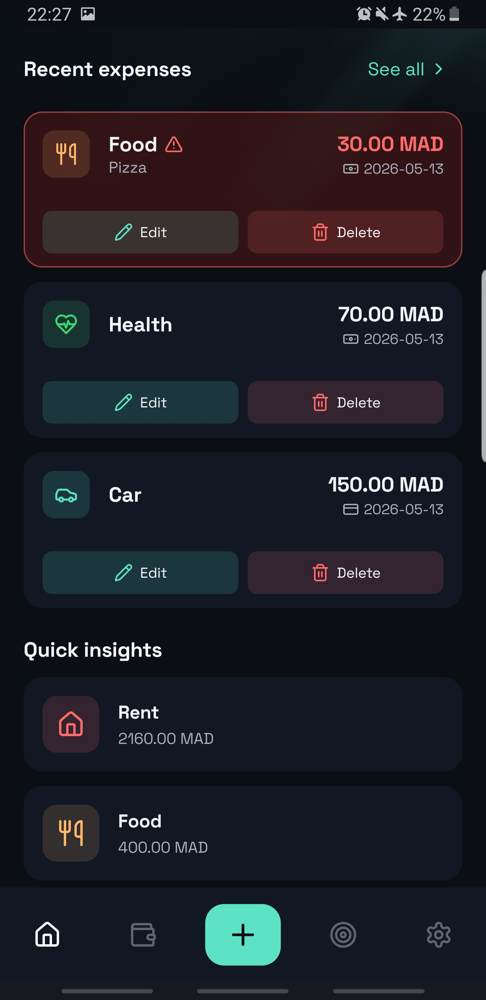

**Add Expense Form**
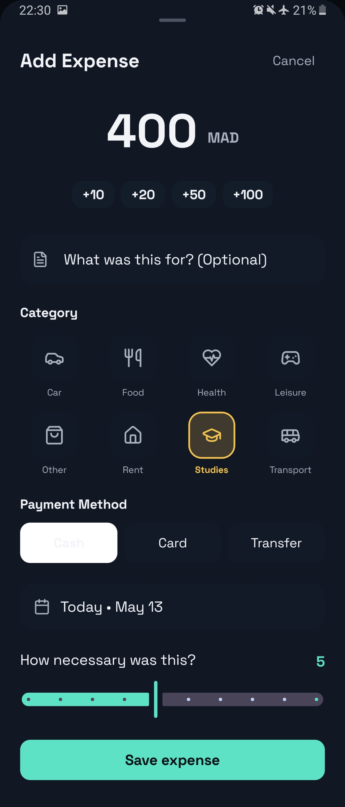

**Expense History**
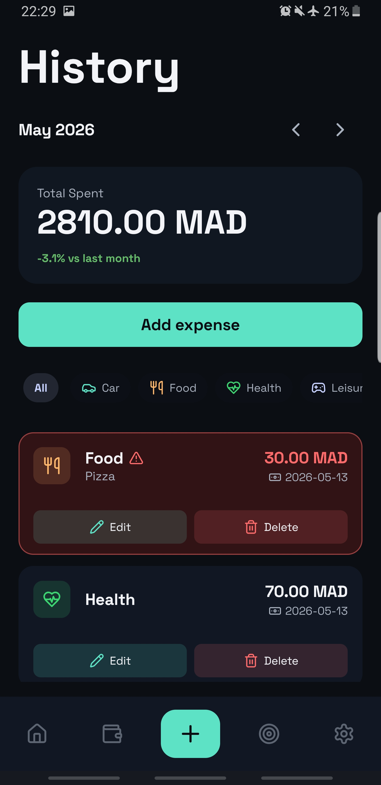

**Budgets Screen**
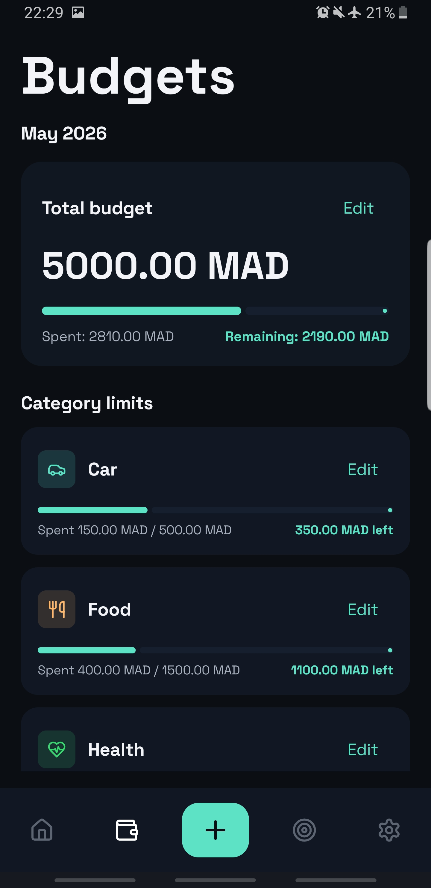

**Savings Goals Tracking**


**Settings & Preferences**
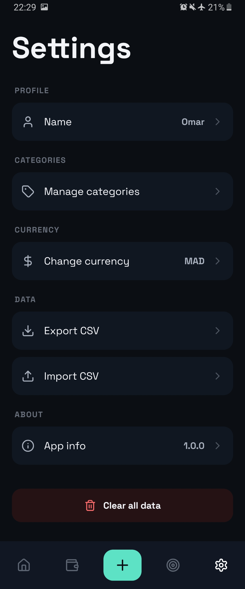

---

## �🔄 Future Enhancements

- 📊 Advanced analytics and reporting
- 📅 Budget forecasting
- 💬 Expense notes with search
- 🏷️ Tags for expenses
- 📱 Widget support
- 🌐 Multi-device sync (optional cloud backup)
- 📈 Spending trends and predictions
- 🎯 Goal templates for common savings objectives

---

## 👨‍💻 Engineering Effort & Development

### Overcoming Technical Challenges
To achieve a professional standard, this project utilizes the latest industry-standard tools:
- **Declarative UI Paradigm:** Built entirely with **Jetpack Compose**, bypassing traditional XML layouts for dynamic, custom-animated components (like interactive Bottom Sheets and Native Date Pickers).
- **Reactive State Management:** **Kotlin Coroutines** and **StateFlow** entirely decouple the UI from the database, ensuring real-time UI updates without app crashes, even during heavy SQL aggregate queries.
- **Clean Architecture Strictness:** The codebase is meticulously separated into layers (Entities, DAOs, Repositories, ViewModels, and UI Composables) for an infinitely scalable and highly maintainable codebase.
- **Data Precision:** All financial amounts are locally stored in the Room database as integers representing minor units (e.g., cents) to fundamentally prevent floating-point precision loss.

### Key Design Principles

1. **Simplicity First**: Every feature must add clear value without adding complexity
2. **Privacy by Default**: No tracking, no cloud, no surprises
3. **Offline-First**: Full functionality without internet connection
4. **Reactive State**: Real-time UI updates using Kotlin Flows
5. **Goal-Oriented**: All features ultimately support better saving habits through goals

### Code Quality
- Clean architecture with clear separation of concerns
- MVVM pattern for UI state management
- Dependency injection via AppContainer
- Type-safe database access with Room
- Coroutines for async operations
- StateFlow for observable state

---

## 📝 License

This project is provided as-is. Feel free to modify and use for personal or educational purposes.

---

## 🤝 Contributing

As this is a personal project, contributions are not currently being accepted, but feedback and suggestions are always welcome!

---

## 📧 Contact

For questions, suggestions, or feedback about SmartBudget, feel free to reach out.

---

## 🙏 Acknowledgments

- Built with **Jetpack Compose** for modern Android UI
- Uses **Material Design 3** for consistent design language
- Powered by **Kotlin Coroutines** for efficient async operations
- Data persistence with **Room Database**
- Icons from **Lucide Icons**

---

**SmartBudget** — *Smart Saving, Simple Living* 💰
